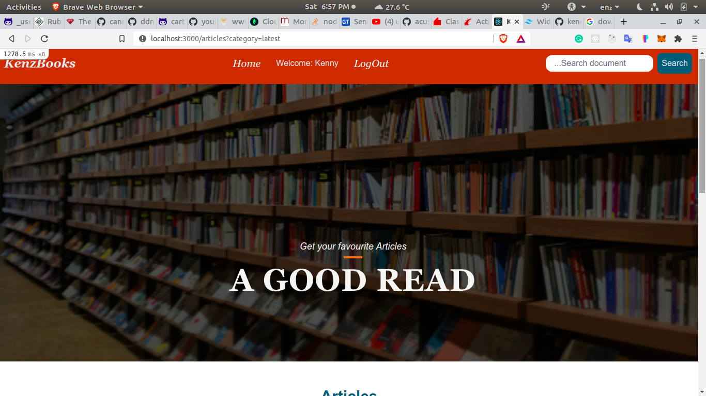

# KenzBookz

This is a website where you can download different books to read and upload your own free books for others to download and read.

## Screenshot

## Live link
[Live](https://kenzbookz.onrender.com/)

The mobile version is still under construction

## Built With

- Ruby
- RubyonRails
- HTML
- CSS
- Bootstrap
- Tailwindcss

## Getting Started

To get a local copy up and running follow these simple example steps.

- Clone the repo by typing `git clone git@github.com:keneogu/KenzBooks.git` in your terminal
- `bundle install` - This will install all the gem files

## Run locally

- `./bin/dev` - This will run the app locally in the local environment
- Go to `https://localhost:3000/` on your browser
- Try it!!

## Author

👤 **Kenechukwu Oguagbaka**

- GitHub: [@keneogu](https://github.com/keneogu)
- Twitter: [@keneogu](https://twitter.com/keneogu)
- LinkedIn: [@keneogu](https://www.linkedin.com/in/oguagbaka-kenechukwu-8b2289179/)

## 🤝 Contributing

Contributions, issues, and feature requests are welcome!
